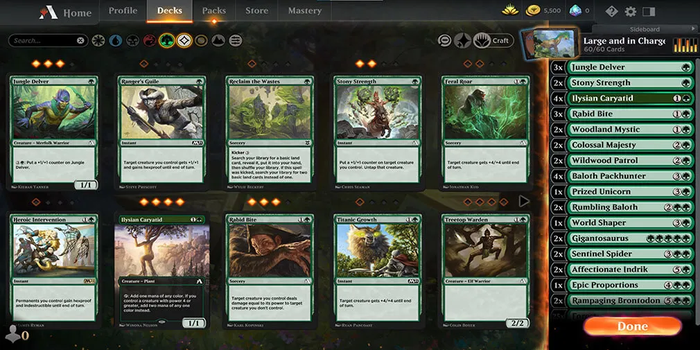

# Réunion du 17/03/2022

    Présents : Mehdi, Louis, Matthieu (Team Front)
  
## Sujets abordés :
  - Palettes de couleurs à utiliser pour le site
  - Premières pages à faire sur figma
  - Discussion sur certaines conctionnalité
  - Objectifs avant la prochaine réunion

## Palettes de couleurs à utiliser pour le site

  Nous avvons commencé par discuter des palettes de couleurs que nous voulions utiliser pour la réalisation du site. Version sombre privilégiée en premier. 
    
  Couleurs soumises :
  - Violet sombre
  - Bleu sombre
  - Marron sombre

  Inspirations : 
  - Messenger en mode dark bleu
  - Les couleurs de bases de discord
  - La page de recherche [WOTC](https://gatherer.wizards.com/Pages/Default.aspx)

## Premières pages à faire sur figma

  Priorisation des premières pages à faire à partir du premier MVP des fonctionnalité.

  Nous avons décidé que les premières pages à réaliser sur figma seront :
  - Page d'arrivée sur le site
  - Page de création de deck
  - Page de recherche
  - Page de présentation d'une carte

  Pour la réalisation de ces pages notemment l'orgnisation des elements nous avons pris inspiration sur :
  - [Lotus Noir](https://www.lotusnoir.info/magic/cartes/cobra-de-lotus/ZNR/ZNR193/) , [EDHREC](https://edhrec.com/cards/lotus-cobra) pour la présentation d'une carte.
  - [Lotus Noir](https://www.lotusnoir.info/magic/decks/final-ghired/), [Magic-ville](https://www.magic-ville.com/fr/decks/showdeck?ref=912016) pour la création de deck.
  - [MKM](https://www.cardmarket.com/fr/Magic), [WOTC](https://gatherer.wizards.com/Pages/Default.aspx) pour la page de recherche

## Discussion sur certaines conctionnalité

  En même temps que de parler des premières pages à réaliser nous avons proposé des idées d'arrangement de pages notement pour la page de création/présentation de deck. Où mettres les différents éléments et comment bien agencer la page.

  Exemple de MTGa :

  

## Objectifs avant la prochaine réunion

  Proposition de palettes de couleurs et premier agencement des pages dont on a parlé précedement. Faire le début de la liste des fonctionnalités détaillées à partir des user stories et faire le ranking sur celles-ci.

