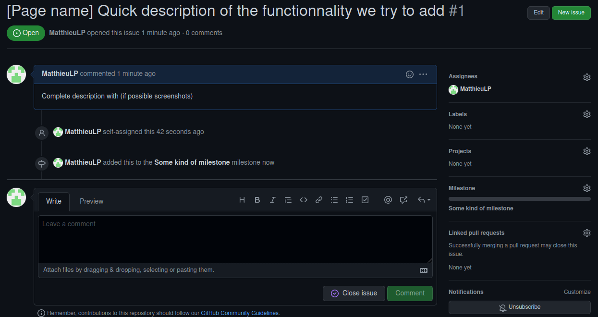

# How do we work together ?

We use the [Gitflow](https://www.atlassian.com/fr/git/tutorials/comparing-workflows/gitflow-workflow) as a workflow to work in our codebase. We will use github issues to track tasks, bugs... and to visualize who is working on what. We will refer to an issue in each commit.

## Issues

### How to create an issue ?

 - The issue must be written in English.
 - The page the issue is about is put first between "[]" and then the title of the issue.
 - It must have a desciption (as accurate as it can be) with screenshots of the mockup if they exists or a screenshot of the problem (if possible).
 - When you work on an issue you must assign it to yourself
 - Labels are optionnal.
 - Assign your issue to a Milestone.

### How to work on an issue ?

 - Create a branch with the name "issue-XXXX-issueName" where XXXX is the number of the issue.
 - When you do a commit, your commit message must contain the issue it is related to. Ex : "related to #123 Fix shit". "#123" refers to the number of the issue and "Fix shit" is a quite simple but efficient description.

Do not hesitate to write some comment on the issue it self on 
github, if you have a problem the next one working on it will see your reflexion and it also keeps track of your thinking process.

### How to close an issue ?

 - You can close an issue by adding "fixes #123 Shit solved", this will automatically close the issue on github. You can also do a normal commit and close the issue manually on github.

### How to merge a branch ?

 - When we finished working on a branch, we merge it into develop and remove the remote branch. Notice that, if we have more than 1 commit in the work branch, we need to squash commit before merge. We squash and merge with the github merge GUI.

## Working on discord

As you know we created a discord server on wich you all are. There are some specific channels which are for specific uses which I will explain.

 - général : for random talks.
 - ressources : for ressource links, images, tutorial videos etc...
 - front-end : discussions about front-end.
 - back-end : discussions about back-end.

 - work-report : In this channel there will be no discussions but report about what you've worked when you're working on something. Ex : "J'ai travaillé sur un POC d'authentification ajd" or "J'ai regardé un tuto pour faire un tableau en vueJS pour tel page".
 - need-help : If you have any problem do not hesitate to ask for help we are here to help each other, do not stay locked alone on your problem.

## How to write code

### Javascript

We will use ECMAScript 6 (ECMAScript 2015) to benefit from latest features of the language (const, let, arrow functions, ..)

### Front-end

We will use the official ESLint plugin for Vue.js. This plugin is already setup with a Vue2 clean project.

This plugin is usefull to :
- Finds syntax errors.
- Finds the wrong use of Vue.js Directives.
- Finds the violation for Vue.js Style Guide.

### Back-end

We will use also eslint ans prettier for our node.js project, to setup the back-end we will use this [article](https://blog.bitsrc.io/how-to-set-up-node-js-application-with-eslint-and-prettier-b1b7994db69f).

*Of course, we must be rigorous and don't use another formater with our IDE or code editor.*

